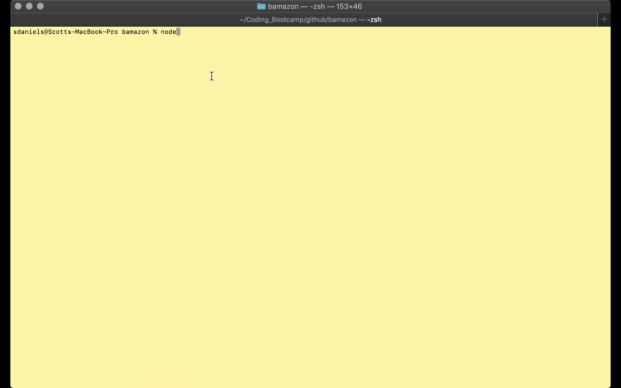
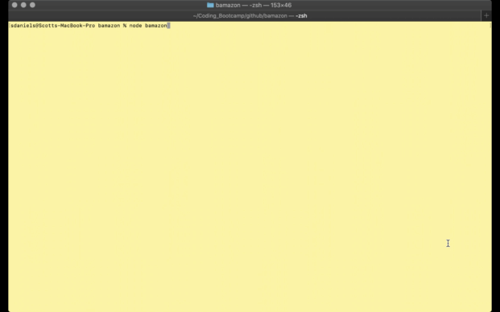

# bamazon node app
## Full Stack Development Bootcamp - Node.js &amp; MySQL

The purpose of this homework assignment was to make a really bad version of amazon, that doesn't deliver items on time, and has a very limited inventory.  But that's ok, you get to be both the customer and the manager of this fine online store.

The app makes use of the following node.js packages:
* mysql - used to connect to our MySQL database that will house the store inventory.
* inquirer - used to provide the interface to our CLI application.
* dotenv - used to access environmental variables, which is what we use to store the MySQL credentials.

## __Instructions__

### __Prerequesites__

In order to use this application you'll need to have the following dependencies installed:
* git - [Link](https://git-scm.com/)
* node - [Link](https://nodejs.org/en/)
* MySQL - [Link](https://dev.mysql.com/downloads/mysql/)

## Installation

Once the above dependencies are installed.

To use this application, you'll need to first clone the repo.

Firstly, you'll want to open your terminal, and navigate to either your home directory, or one of your choosing.  When you are ready to begin installation, perform the following:

```
git clone https://github.com/sdaniels6363/bamazon.git
```

Once cloned, navigate to the directory that it was cloned into.

```
# For the sake of instructions we'll assume you have cloned to your home directory.

cd ~/bamazon/
```

Your next step will be to perform the dependency installation of the necessary javascript libraries.

From your terminal, issue the following commands

```
npm install
```

Next, you'll need to create your .env file, this file should go in the same directory that you have cloned the repo to.  This is the file that will be used to store your API keys that are required for the application to function.

```
touch .env
```

Then add the MySQL database credentials to the .env file.

```
MYSQL_USER="<your-db-user>"
MYSQL_PASS="<your-pass>"
```

This guide assumes you know how to setup a local MySQL instance, if you need help with that, please see the following link(s). 
- [Mac](https://dev.mysql.com/doc/refman/8.0/en/osx-installation.html)
- [Windows](https://dev.mysql.com/doc/refman/8.0/en/windows-installation.html)

Once you have added the credentials you should be good to go. 

## Pre-populating the database

Open the base.sql file, and copy and paste the contents into MySQL workbench to populate the base database configuration.

## Examples
 - The bamazonManager.js file runs the management console for the database, here the user can monitor and restock inventory as well as add new items.



- The bamazonCustomer.js file runs the console for the database, here the user can select items for purchase, they're also given the ability to purchase multiple items.


